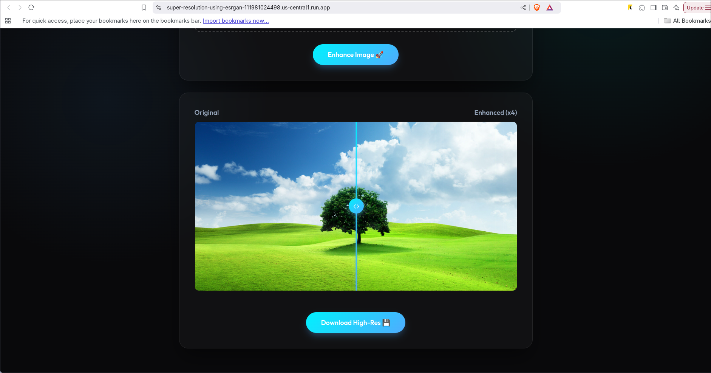
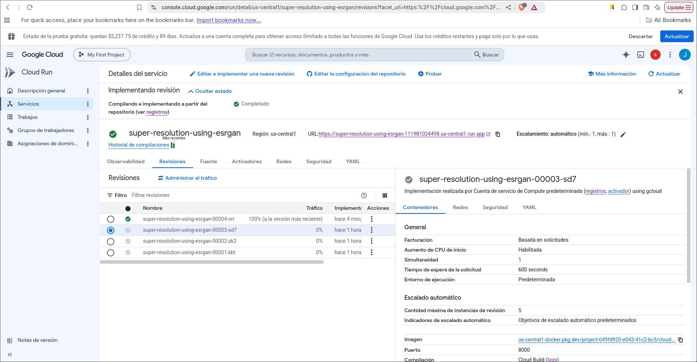

<div align="center">
  <h1>ESRGAN Image Super-Resolution</h1>
  <p>An end-to-end Computer Vision project implementing Enhanced Super-Resolution Generative Adversarial Networks (ESRGAN) to upscale images by 4x without losing quality. Features a trained Deep Learning model, a FastAPI backend, an interactive UI, and serverless Cloud deployment.</p>
</div>

---

## Web Interface & Cloud Deployment

This project includes a production-ready Web API built with **FastAPI** and a modern, responsive frontend featuring an interactive before/after image comparison slider. The API is containerized using **Docker** and designed for serverless deployment on **Google Cloud Run**.

<div align="center">
  
  <br><br>
  
</div>

---

## Performance & Benchmarks

- **Training:** Training the model for 40 epochs took approximately 8 hours on a laptop equipped with an Intel Core i5-11400H, an NVIDIA RTX 3050 (4GB VRAM), and 16GB of RAM. *(Note: Training configuration and batch sizes are highly hardware-dependent. The current settings in this repository are tuned for this specific hardware and may need to be adjusted for optimal performance on other machines).*
- **Inference (Cloud Run CPU):** Processing the landscape example image (tree) takes around 5 minutes using Google Cloud Run (configured with 4GB RAM and 4 vCPUs).
- **Inference (Local GPU):** Running the inference locally using the NVIDIA RTX 3050 significantly decreases processing time, taking only ~20 seconds per image, so, using a premim cloud Run with GPU support would significantly decrease processing time.

---

## Super-Resolution Results (4x Upscaling)

The model was trained on the Flickr2K dataset. The 40-epoch checkpoint yielded the best perceptual results. Below is a comparison between the original low-resolution images and the AI-generated 4x upscaled versions.

### Landscape Example
| Original Image | AI Enhanced (4x) |
| :---: | :---: |
|  |  |

**Zoomed Details:**
| Original (Zoom) | AI Enhanced (Zoom) |
| :---: | :---: |
|  |  |

### Urban Example
| Original Image | AI Enhanced (4x) |
| :---: | :---: |
|  |  |

**Zoomed Details:**
| Original (Zoom) | AI Enhanced (Zoom) |
| :---: | :---: |
|  |  |

---

## How to use this project

You can run this project in several ways depending on your needs. First, clone the repository:

```bash
git clone https://github.com/Jose117053/super-resolution-using-ESRGAN.git
cd super-resolution-using-ESRGAN
```

### Option 1: Train the model from scratch
If you want to train the GAN yourself:
1. Download the **Flickr2K dataset** (link provided in `Proyecto_RN.pdf`).
2. Place the dataset in the root folder (named as `Flickr2K`).
3. Open `gan.ipynb` in Jupyter Notebook or Google Colab and run the training cells.

### Option 2: Use Pre-Trained Weights (Recommended)
Skip training and use the pre-trained weights for instant upscaling:
1. Download `checkpoint_epoch_40.pth` (approx. 300MB) from this [Google Drive Link](https://drive.google.com/drive/folders/1ls7agCZf1gINa6KbFp79RVpuRtOCGJtu?usp=sharing).
2. Create a folder named `checkpoints/` in the root directory and place the downloaded file inside.

### Option 3: Run Inference via Terminal (CLI)
Once you have the `.pth` checkpoint, you can upscale images directly from your terminal (the name of the .pth file is defined in config.py with the variable `CHECKPOINT_PATH`, you can change it if you want (depending the epoch you trained until)):
```bash
# Upscale a single image
python upscale.py --input images/foto.jpg --output scaledImages/foto_x4.jpg

# Upscale a full directory of images
python upscale.py --input ./images/ --output ./scaledImages/
```

### Option 4: Run Inference via Jupyter Notebook
You can also use the final cells inside `gan.ipynb` to load an image, pass it through the Generator model, and visualize the upscaled output directly within the notebook interface.

### Option 5: Launch the Web UI Locally
To use the web interface on your own machine:
```bash
pip install -r requirements.api.txt
uvicorn app:app --reload
```
Then, open your browser and go to `http://localhost:8000`.

---

## Docker & Cloud Deployment

To deploy this project to the cloud (or run it isolated via Docker), simply build the provided `Dockerfile.api`. 
*Note: The Dockerfile automatically downloads the heavy `.pth` checkpoint from Google Drive during the build process to ensure a self-contained environment.*

### 1. Build and Run the Web API
```bash
docker build -t esrgan-api -f Dockerfile.api .
docker run -p 8000:8000 esrgan-api
```

### 2. Run Inference Script inside Docker
If you want to use the CLI script `upscale.py` inside the container and save the results back to your host machine, use volume mounts:
```bash
docker run --rm -v $(pwd)/images:/app/images -v $(pwd)/scaledImages:/app/scaledImages esrgan-api python upscale.py --input ./images/tree.jpg --output ./scaledImages/treeX4.jpg
```

## References
- [ESRGAN: Enhanced Super-Resolution Generative Adversarial Networks (arXiv)](https://arxiv.org/pdf/1809.00219)
- [SRGAN: Super-Resolution Generative Adversarial Networks (OpenAccess)](https://openaccess.thecvf.com/content_cvpr_2017/papers/Ledig_Photo-Realistic_Single_Image_CVPR_2017_paper.pdf)
- [Perceptual Losses for Real-Time Style Transfer and Super-Resolution (arXiv)](https://arxiv.org/pdf/1603.08155)
- [An Intuitive Introduction to GANs (freeCodeCamp)](https://www.freecodecamp.org/news/an-intuitive-introduction-to-generative-adversarial-networks-gans-7a2264a81394)
